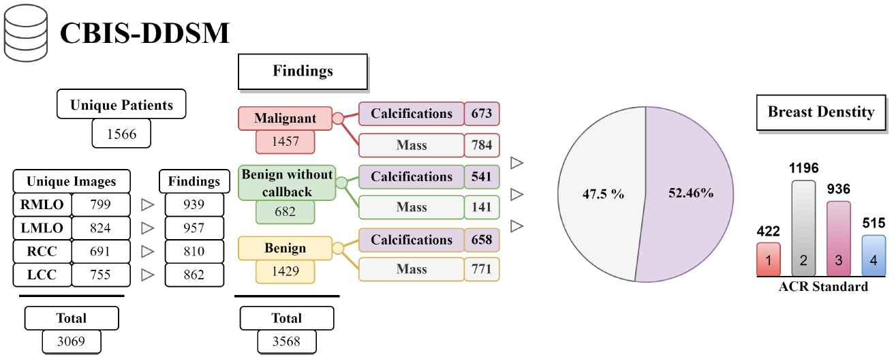
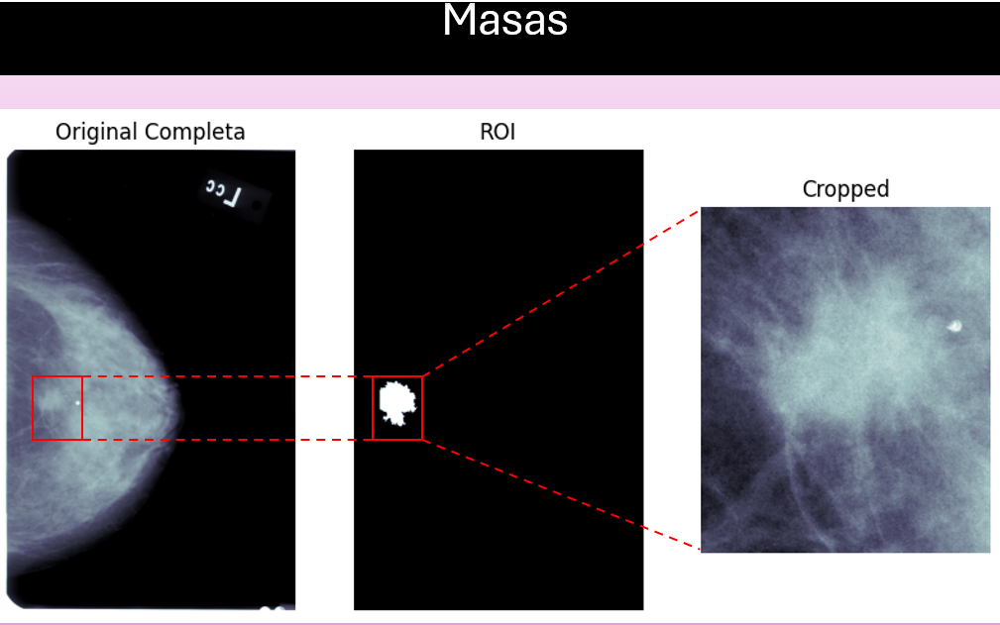
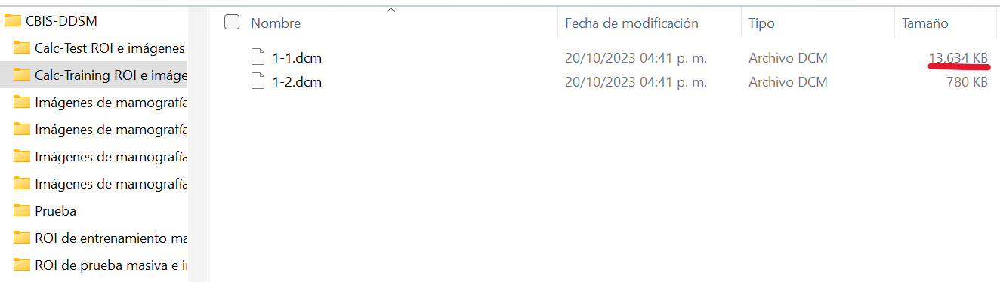
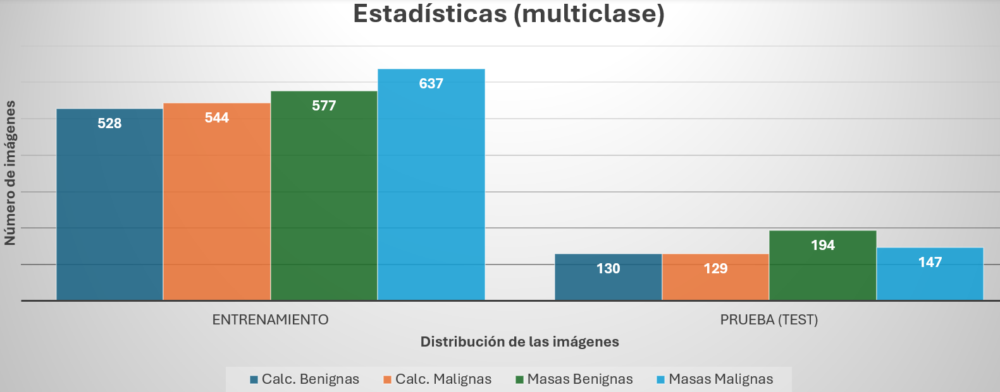
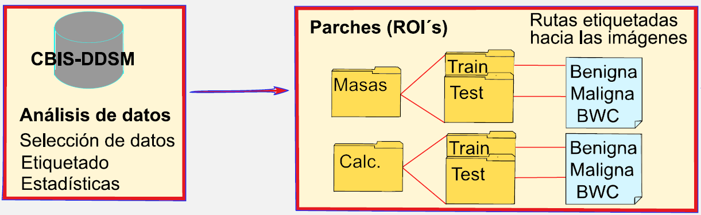

# EDA CBIS-DDSM

You can view the analysis carried out to obtain the patches related to masses [here](./labeled_cropped_MASS.ipynb), which helped correctly extract and label the image patches associated with masses from the CBIS-DDSM database. These patches were part of the dataset used for my thesis work. For more context, you can keep reading.

This repository includes a brief Exploratory Data Analysis (EDA) of the [CBIS-DDSM database](https://github.com/LuisGuillermoRL/EDA_CBIS-DDSM/blob/main/docs/sdata2017177.pdf). It remains significant, as machine learning and deep learning algorithms were implemented for the **early detection of breast cancer**, as is well known, developing reliable models, particularly for classification, requires clean and properly labeled data. In the literature reviewed on this topic, some authors present statistical distributions of the dataset, while others do not, and even when they do, the reported statistics were inconsistent. For reference, the **survey of public datasets for early breast cancer detection** by [Mracko et al. (2023)](./docs/jimaging-09-00095.pdf) presents the following statistics regarding the CBIS-DDSM database:

CBIS-DDSM is the database used in the experiments for this Master’s Thesis. It is the largest publicly available and easily accessible breast cancer dataset, and it can be downloaded [here](https://www.cancerimagingarchive.net/collection/cbis-ddsm). It is worth mentioning that I accessed the dataset on October 20, 2023, a few months after the publication by Mracko et al. (2023), but over a year after their reported access date (March 10, 2022). CBIS-DDSM is an updated version of the original DDSM database, which was released in 1997. This newer version includes ROI (Region of Interest) segmentation or patches of abnormalities (masses and calcifications), masks to extract those patches, as well as the full mammograms in DICOM (Digital Imaging and Communications in Medicine) format, accompanied by data dictionaries in CSV format. Although CBIS-DDSM provides valuable metadata, such as the one shown in the previous image, its most important feature is that the labels assigned to each mammogram, specifically the **pathology (benign or malignant)**, are confirmed through biopsy results, in contrast, the INbreast database does not have all of its labels biopsy-validated and the MIAS database contains only 330 samples.

**Note:** The label Benign Without Callback (BWC) indicates that the radiologist considered the breast tissue benign and not requiring a biopsy, though it should still be monitored. Below are a couple of samples from this dataset.

In the images above (from left to right), you can see the full mammograms (original), followed by the ROI masks used to extract the cropped patches where the abnormalities (masses or calcifications) are located. This is because it is not necessary to work with the entire mammogram when implementing a Convolutional Neural Network (CNN). **The analysis in this thesis focused on those extracted patches**.

It is important to note that the dataset can be downloaded in parts, that is, you can choose to download either the complete mammograms, from which the abnormalities are extracted, or the ROI masks and cropped patches directly. In order to retrieve patient information and obtain the corresponding labels, it is necessary to download the CSV files located within the dataset folders. As mentioned earlier, many authors report different statistics for this dataset, furthermore, Mracko et al. (2023) described several issues related to the datasets mentioned above. The image below illustrates this as a starting point.

This image below shows two files in DICOM format (with a *.dcm* extension), one being significantly larger than the other. The larger file usually corresponds to the mask (ROI), while the smaller one corresponds to the cropped patch. Apparently, the file ending in *1-1.dcm* usually represents the mask, and *1-2.dcm* corresponds to the patch, however, this is not always consistent. This inconsistency points to mislabeling within the dataset, making an exploratory data analysis (EDA) absolutely essential.

The purpose of this repository is to show how the correct labels for the patches were recovered or assigned, so that they could be used to train machine learning and/or deep learning algorithms. It’s important to note that this "filtering" or proper labeling of the patches was done using two approaches:

1) **Filtering by file size**. An initial threshold of 2 MB was set to separate the files into two lists, resulting in a preliminary set of patches. The threshold was then raised to 5 MB and later to 10 MB. This process helped isolate the majority of patches for both masses and calcifications while discarding misclassified files. However, some patches remained ambiguous. Raising the threshold beyond 15 MB did not improve the separation, so the remaining files were manually inspected and selected through image plotting. Although this process was tedious, the final patch count matched the numbers reported by Mracko et al.

2) **Using DICOM file metadata**. **PyDICOM** is a Python package used to read DICOM files, which contain a wealth of metadata. This tool allowed for quicker inspection and visualization of DICOM images and was particularly helpful in retrieving patches along with their correct labels more efficiently. This second method is the one presented and used in this repository.

It is worth mentioning that both methods resulted in the same number of images! **You can view the analysis performed to obtain the patches related to masses** [here](./labeled_cropped_MASS.ipynb). The process for calcifications is very similar. After completing this analysis, it was possible to obtain more specific statistics (related to the pathologies of the mammograms) than those reported by Mracko. These statistics are shown below, excluding the images labeled as *BWC*.

Moreover, once the paths to the patches with their corresponding labels are obtained, **a better data split can be performed**. The data can now be organized first by abnormality type, then by training (Train) or testing (Test) set, followed by pathology (B, M, BWC), and finally by the original file path. This structure is illustrated below, and the simple script used for this process can be found [here](./Copiar_parches_a_otro_destino.ipynb).

